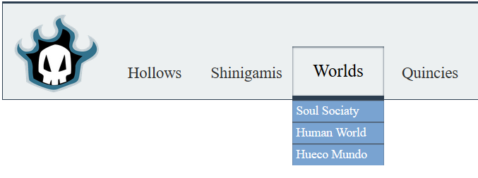
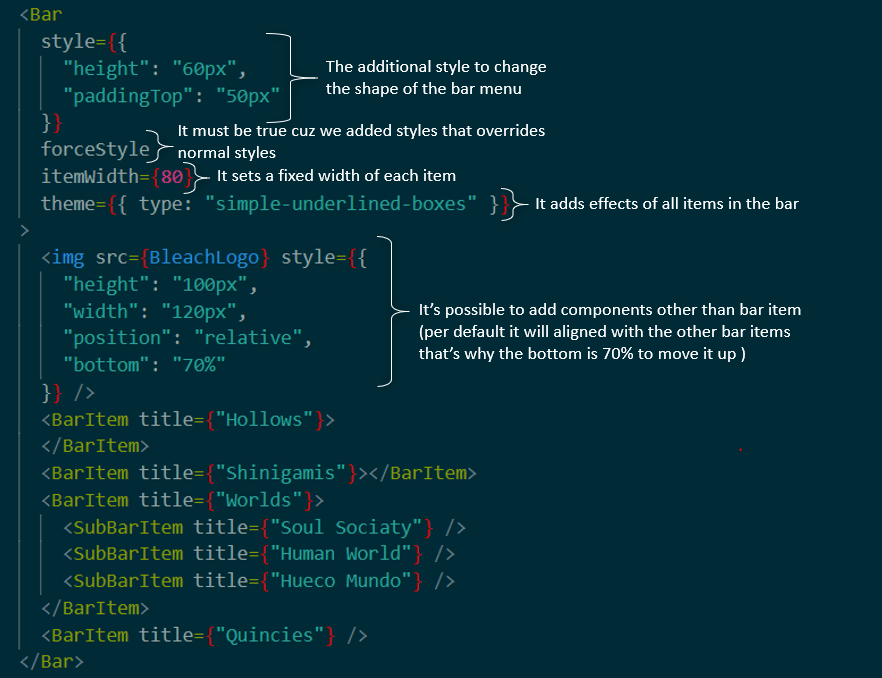

# React Costumized Navigation Bar

> it's a react component for creating fully functionnal stylish menu bar

Look at the header of most of websites, don't you often see that there is a menu that contains ( profile , principal sections of the website , login ... ), dear developer now you can implement quickly this solution and you are free to style it according to your preferences 😁
<br>
[Click me to see a demonstration ✋ !](https://react-costumized-nav-bar-demo.netlify.com/)
<br>
Let's Begin  😎 !
## Table of Contents
---
<div style="font-size:18px"> <a style="color: currentColor" href="#intro"> ➡️  Introduction </a> </div>
<ul>
    <a style="color: currentColor" href="#specs"><li>Specifications</li></a>
    <a style="color: currentColor" href="#features"><li>Actual & Upcoming Features</li></a>
</ul>
<div style="font-size:18px"> <a  style="color: currentColor" href="#start"> ➡️  Getting Started </a></div>
    <ul><a style="color:currentColor" href="#prerequisites"><li>Prequisities</li></a>
    <a style="color:currentColor" href="#install"><li>Installing</li></a>
    <a style="color:currentColor" href="#props1"><li>Bar Menu Properties</li></a><a style="color:currentColor" href="#props2"><li>BarItem  & SubBarItem Properties</li></a><a style="color:currentColor" href="#example"><li>Example</li></a></ul>
<div style="font-size:18px"><a style="color:currentColor" href="#styling">➡️ Styling the bar menu</a></div>
<ul><a style="color:currentColor" href="#styling1"><li>Material Design Theme</li></a>
<a style="color:currentColor" href="#styling2"><li>Inline Css Styles</li></a></ul>
<div style="font-size:18px"><a style="color:currentColor" href="#author"> ➡️  Authors </a></div>
<div style="font-size:18px"><a style="color:currentColor" href="#licence"> ➡️  Licence </a></div>

<div id="intro">

## Introduction
------

Look at this awesome menu bar done by this lib (I'm sure bleach fans will understand this names 😂 )
<!-- Here A gif that demonstrate the outcome of the lib -->


<div id="specs">

### ► Specifications :
• Easy to use 😉
<br> • Support material design themes 📔
<br> • Full style customization ✂️
<br> • Place it anywhere in your code, it'll work 🎯
<br> • All Browsers(IE, Firefox, Chrome ...) Support 🚀

</div>
<div id ="features">

###  ►  Actual & Upcoming Features :
&nbsp;&nbsp;&nbsp;&nbsp;&nbsp;☑️ Support both vertical and horizontal mode<br>
&nbsp;&nbsp;&nbsp;&nbsp;&nbsp;☑️ Rendering Multiple Sub Items of each Bar Item <br>
&nbsp;&nbsp;&nbsp;&nbsp;&nbsp;☑️ Add-on material design theme for styling <br>
&nbsp;&nbsp;&nbsp;&nbsp;&nbsp;⏹️ Support Rendering Sub Items of Each Sub Items <br>
&nbsp;&nbsp;&nbsp;&nbsp;&nbsp;⏹️ Add-on Styled Profile Section with support of design theme system <br>
&nbsp;&nbsp;&nbsp;&nbsp;&nbsp;⏹️ Add-on Styled Notification Section with support of design theme system <br>

</div>
</div>
<div id="start">

## Getting Started
------
It's simple whether you are a newbie or expert with React, just by following the instructions below you'll be able to use this library and do this cool stuff !
<div id="prerequisites">

###  ►  Prerequisites
</div>

Since you are working with react, it's fine you'll not need to install any other dependancy, 'React >= 16.0' is the only dependancy of this helper 🤗.
<div id="install">

###  ►  Installing
</div>

This package is available in npm repository as react-costumized-nav-bar.
`````
npm install react-costumized-nav-bar --save
`````
Or by Using Yarn.
`````
yarn add react-costumized-nav-bar --save
`````
Now wherever you want in your project, you can import it
`````
import {Bar, BarItem, SubBarItem} from 'react-costumized-nav-bar';
`````

<div id="props1">

###  ►  Bar Menu Properties
</div>

<table>
    <tr>
        <th style="font-size: 18px; color: #fff; line-height: 1.4; background-color: #34495e; text-align: left;">Property</th>
        <th style="font-size: 18px; color: #fff; line-height: 1.4; background-color: #34495e; text-align: left;">Type</th>
        <th style="font-size: 18px; color: #fff; line-height: 1.4; background-color: #34495e; text-align: left;">Default</th>
        <th style="font-size: 18px; color: #fff; line-height: 1.4; background-color: #34495e; text-align: left;
            width: 400px">Description</th>
    </tr>
    <tbody>
    <tr style="border: solid 1px;">
    <td style="border-right: solid 1px;">itemWidth</td>
    <td style="border-right: solid 1px;">number</td>
    <td style="border-right: solid 1px;">auto</td>
    <td>Number of pixels of the length of the width of the Item in the bar menu. Per default it will take the automatic size of the block of the item.</td>
    </tr>
    <tr style="border: solid 1px;">
    <td style="border-right: solid 1px;">itemsPosition</td>
    <td style="border-right: solid 1px;"> vertical | horizontal </td>
    <td style="border-right: solid 1px;"> horizontal </td>
    <td>Specifies the mode of display of the bar and its items.</td>
    </tr>
    <tr style="border: solid 1px;">
    <td style="border-right: solid 1px;">width</td>
    <td style="border-right: solid 1px;"> number </td>
    <td style="border-right: solid 1px;"> 100% or auto </td>
    <td>Number of pixels of the length of the width of all the menu bar. Per default it will take 100% of the size if the bar is on horizontal mode or auto on vertical mode. </td>
    </tr>
    <tr style="border: solid 1px;">
    <td style="border-right: solid 1px;">height</td>
    <td style="border-right: solid 1px;"> number </td>
    <td style="border-right: solid 1px;"> 100% or auto </td>
    <td>Number of pixels of the length of the height of all the menu bar. Per default it will take 100% of the size if the bar is on vertical mode or auto on horizontal mode. </td>
    </tr>
    <tr style="border: solid 1px;">
    <td style="border-right: solid 1px;">type</td>
    <td style="border-right: solid 1px;"> simple | simple-underlined | simple-underlined-boxes </td>
    <td style="border-right: solid 1px;"> simple </td>
    <td>It's a way to make the menu bar more stylish and support multiple designs by simply adding keywords (simple , underlined, boxes ..). <div style="font-style: italic;font-size: 11px;">You're welcome to suggest any design mode to work on it 🤩 ✌️ !</div></td>
    </tr>
    </tr>
    <tr style="border: solid 1px;">
    <td style="border-right: solid 1px;">style</td>
    <td style="border-right: solid 1px;">object</td>
    <td style="border-right: solid 1px;">{}</td>
    <td>The inline-style to combine css styles to the bar</td>
    </tr>
    <tr style="border: solid 1px;">
    <td style="border-right: solid 1px;">forceStyle</td>
    <td style="border-right: solid 1px;">true | false</td>
    <td style="border-right: solid 1px;">false</td>
    <td>It's linked to the style property, some css properties added in style may have some conflicts, If the forceStyle is set to true, all the css in style overrides the existed css in the bar.</td>
    </tr>
    </tbody>
</table>
<br>

<div id="props2">

###  ►  BarItem  & SubBarItem Properties
</div>

<table>
    <tr>
        <th style="font-size: 18px; color: #fff; line-height: 1.4; background-color: #34495e; text-align: left;">Property</th>
        <th style="font-size: 18px; color: #fff; line-height: 1.4; background-color: #34495e; text-align: left;">Type</th>
        <th style="font-size: 18px; color: #fff; line-height: 1.4; background-color: #34495e; text-align: left;">Default</th>
        <th style="font-size: 18px; color: #fff; line-height: 1.4; background-color: #34495e; text-align: left;
            width: 400px">Description</th>
    </tr>
    <tbody>
    <tr style="border: solid 1px;">
    <td style="border-right: solid 1px;">title</td>
    <td style="border-right: solid 1px;">string</td>
    <td style="border-right: solid 1px;">Empty Title</td>
    <td>The text displayed  in the block Item on the bar</td>
    </tr>
    <tr style="border: solid 1px;">
    <td style="border-right: solid 1px;">style</td>
    <td style="border-right: solid 1px;">object</td>
    <td style="border-right: solid 1px;">{}</td>
    <td>The inline-style to combine css styles to the bar</td>
    </tr>
    </tbody>
</table>
<br>

<div id="example">

###  ►  Example
</div>

*It's so simple, The use of each component is pretty intuitive 😉 ; For more clarification ↓↓↓ check the example below ↓↓↓*

The sample code :
```
import {Bar, BarItem, SubBarItem} from 'react-costumized-nav-bar';

...
          <Bar>
            <BarItem title={"Hollows"}>
            </BarItem>
            <BarItem title={"Shinigamis"}></BarItem>
            <BarItem title={"Worlds"}>
              <SubBarItem title={"Soul Sociaty"} />
              <SubBarItem title={"Human World"} />
              <SubBarItem title={"Hueco Mundo"} />
            </BarItem>
            <BarItem title={"Quincies"} />
          </Bar>
...
```
The output result :
<br>
<!-- ![image] -->


<div id="styling" />

##  Styling the bar menu

-------

It's very important to make the bar menu look awesome because it one of the things that reflects the beauty of the website ! Now , You'll see how you can use the properties to make the bar menu more stylish.<br>
*The previous example will be refactored to use the properties that makes the bar menu look more stylish ↓↓↓ check the improved example below ↓↓↓*

The sample code :
```
import {Bar, BarItem, SubBarItem} from 'react-costumized-nav-bar';

...
        <Bar
        style={{
            "height": "60px",
            "paddingTop": "50px"
        }}
        forceStyle
        itemWidth={80}
        theme={{ type: "simple-underlined-boxes" }}
        >
        
        <BarItem title={"Hollows"}>
        </BarItem>
        <BarItem title={"Shinigamis"}></BarItem>
        <BarItem title={"Worlds"}>
            <SubBarItem title={"Soul Sociaty"} />
            <SubBarItem title={"Human World"} />
            <SubBarItem title={"Hueco Mundo"} />
        </BarItem>
        <BarItem title={"Quincies"} />
        </Bar>
...
```
The output result :



The Explanation :



<br>
<div id="author">

## Authors
</div>

-------
* **Boumhicha El Mehdi** - *Initial work* - [Elmehdibm](https://github.com/elmehdibm/)
<br>
(*Dear developers you're welcome to contribute in this work or just try this solution and leave some comments or maybe some stars to make the helper more available to everyone * 🙏)

<div id="licence">

## License
</div>

--------
This project is licensed under the MIT License - see the [LICENSE.md](.\LICENSE.md) file for details
